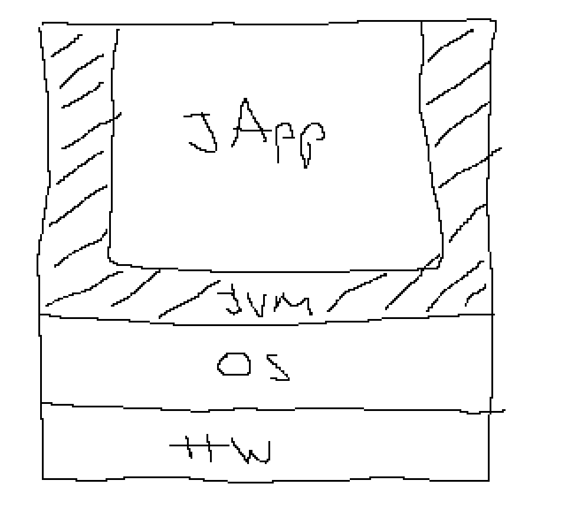

# Datenpersistenz

- Datei
  - Name (name + Extension)
  - Pfad
  - Inhalt
- Dateisysteme
  - Microsoft
    - FAT12
    - FAT16
    - FAT32 (3GB-32GB)
    - NTFS
    - exFAT
  - Linux
    - ext, ext2, ext3, ext4
    - reiserfs
    - btrfs
    - ...
- Datenträger
  - mechanisch
    - Lochkarte
    - Lochstreifen
  - magnetisch
    - Kasette
    - Floppy
    - HDD
  - optisch
    - CD
    - DVD
    - Blu-ray
  - elektronisch
    - USB-Stick
    - SSD
    - NVMe
  - Dateiformate
    - Textdateien
      - *.txt
      - *.csv
      - *.ini
      - *.xml
      - *.json
      - *.svg
    - Binärdateien
      - *.doc, *.docx, *.xls, *.xlsx, ...
      - *.odt, ...
      - Bilder
        - *.jpg, *.png, *.gif, *.tif, *.raw
        - *.dwg, *.ipt
      - Multimedia
        - *.mp3, *.mp4

## Textformate

- csv
- ini
- json
- xml

Beispieldateien:

`leds.csv`

```csv
Name1;255;0;0;128;10
Name2;0;255;0;128;10
Name3;0;0;255;128;10
```

`leds.ini`

```ini
[config]
anzahl=3

[led_0]
name=Name1
rot=255
green=0
blue=0
white=128
address=10

[led_1]
...
```

`leds.json`

```json
[
    {
        "name": "Name1",
        "red": 255,
        "blue": 0,
        "green": 0,
        "white": 128,
        "adress": 10,
    }
    {
        "name": "Name2",
        .
        .
        .
    }
]
```

---

# Streams

- byte , byte[ ]
  - Outputstream (Daten schreiben)
    - ``write(byte)``
    - ``flush()``
    - ``close()`` 
    - -> FileOutputStream, ByteArrayOutputStream
    - -> FilterOutPutStream
  - Inputstream (Daten Lesen)
    - ``read()->byte``
    - ``available()->int`` Anzahl der bytes die da sind
    - ``close()``
    - -> FileInputStream
    - -> FilterInputStream

- Char, String (automatische Codierung)
  - Writer (Daten schreiben) (kommt von Outputstream)
    - ``write(byte)``
    - ``flush()``
    - ``close()`` 
    - -> FileWriter, StringWriter(``toString()``)
    - -> FilterWriter
  - Reader (Daten lesen) (kommt von Inputstream)
    - ``read()->char``
    - ``ready()->boolean``
    - ``close()``
    - -> FileReader, StringReader
    - -> FilterReader
  
JApp -> FW -> Gerät
JApp -> BW -> FW -> Gerät

JApp ... Java Applikation
BW ... BufferedWriter
FW ... FileWriter

# Schnittstellentechnik / Bussysteme

- Schnittstelle
  - seriell
    - bit seriell
    - byte seriell
  - parallel
    - bit parallel
    - byte seriell
  
- Serielle Schnittstellen
  - synchron
    - mindestens 3 Leitungen
      - Data
      - Clock -> Rechteckssignal
      - GND
  - asynchron
    - 2 Leitungen
      - Data
      - GND
    - Microcontroller: UART
    - RS232 ("Die serielle Schnittstelle)
      - 3 Kabel
        - RX, TX, GND (RX-TX , TX-RX)
      - bidirektional
      - P2P -> Point to Point
      - max. Länge: 10m; Sinnvoll 2-3m
    - RS422
      - 4 Kabel
        - Tx+, Tx- Rx+, Rx-
        - Master: Tx+ auf Tx+ ; Tx- auf Tx-; Rx+ auf Rx+ ; Rx- auf Rx- 
        - Slave:  Tx+ auf Rx+ ; Tx- auf Rx-; Rx+ auf Tx+ ; Rx- auf Tx-
      - haben Bussadressen
      - Protokoll -> Master/Slave -> Modbus 
      - P2MP -> Point to Multipoint
      - max Länge: 1200m
      - Nachteil: einer hat immer das "Rederecht" -> man kann nur Master-Slave Protokoll verwenden
    - RS485
      - 2 Leitungen
        - Data+, Data-
        - alle Data+ zusammen und alle Data- zusammen
      - haben Bussadressen
      - Protokoll: Master/Slave, Token/Ring, Collision
      - Bsp. Profibus
  
# Serielle Schnittstellen - Software

- Mikrocontroller
  - Register
  - C
- PC
  - OS
    - Windows
    - Linux
    - Betriebssyste-Funktionsaufrufe
    - z.B. `#include <windows.h>`
  - C
  - Java
    - JNI (Java Native Interface -> C funktionen aufrufen)
    - JNA (Java Native Access)
    - FFI (Foreign Function Interface)
    - um die Betriebssystemaufrufe auf jedem Os verwenden zu können
      - j Serial Comm


In der Java Virtual Machine gibt es keine SerialPorts sonder nur NetzwerkPorts

> Harnisch:"I war in da Schule krank wie wir mulitplizieren gelernt haben"
> Hadler:"Pech g´abt

# Bussysteme am Beispiel Modbus

[Modbus Protokoll Spezifikation](doc/modbusprotocolspecification.pdf)

- Modbus
  - Master-Slave Protokoll
  - sehr einfach
  - sehr verbreitet
  - Modbus RTU vs Modbus IP
    - Modbus RTU
      - serialle Schnittstelle
    - Modbus IP
      - über ein Netzwerk
  - "Dezentrale Peripherie" oder "Intelligente Klemme"
  - 